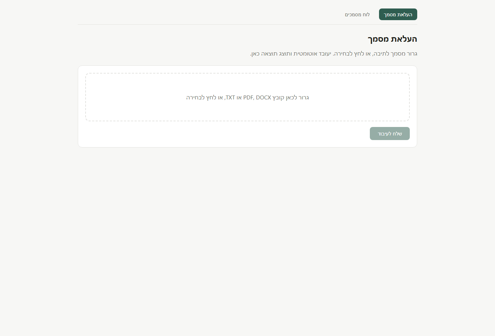
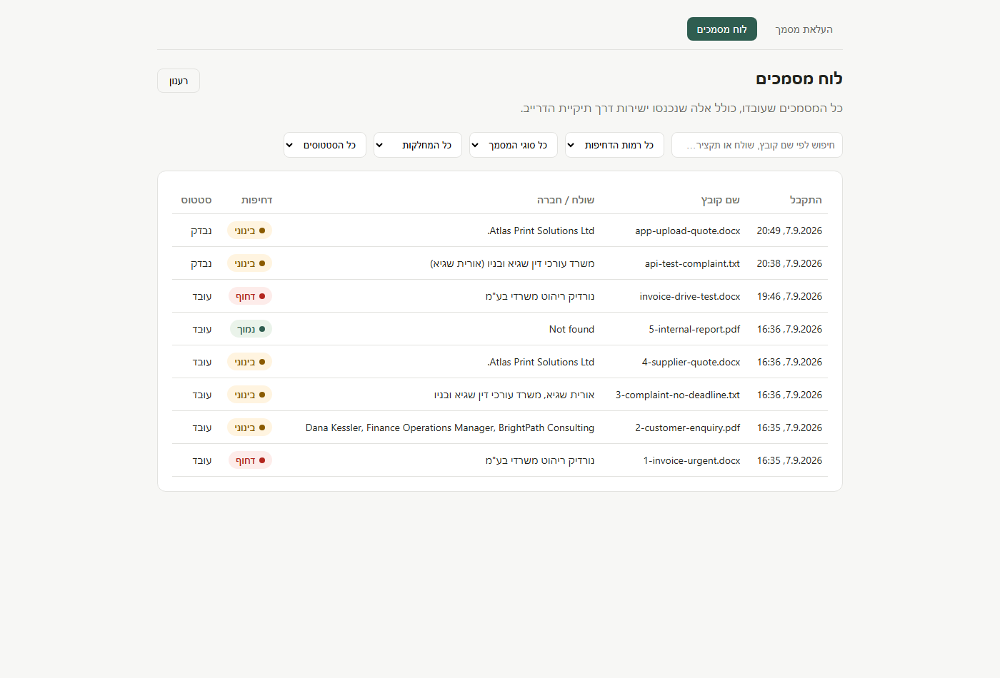
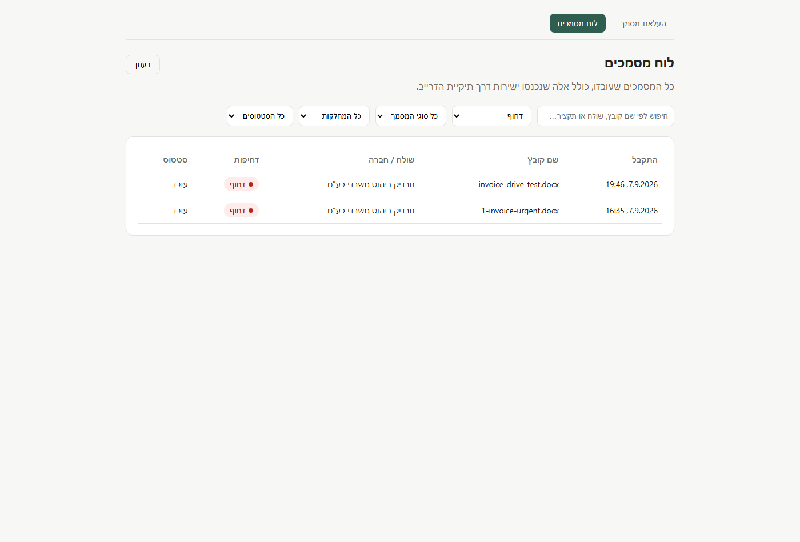
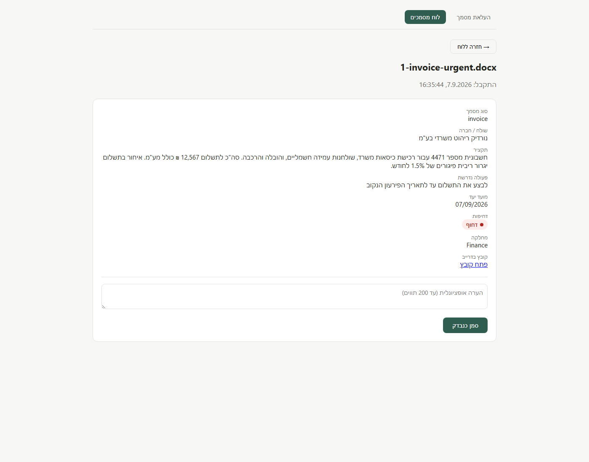
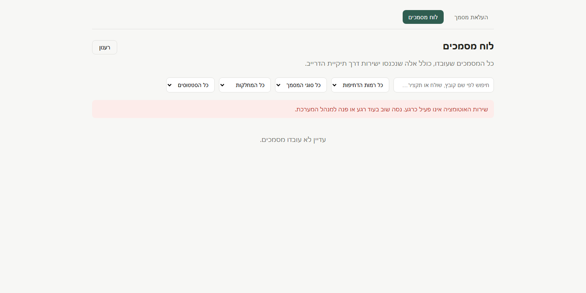

# Demo pack

The documents used to test the pipeline, and what the application looks like
at each step.

```
demo/
├── screenshots/      the flow, in order
└── test-documents/   six documents, each testing something different
```

---

## The test documents

Six synthetic documents. No real client material: every name, company and
amount is invented, because these files pass through an AI model and are read
by whoever reviews this project.

| File | What it tests | Expected result |
|---|---|---|
| `1-invoice-urgent.docx` | An immediate payment deadline | `urgency: High`, urgent email |
| `2-customer-enquiry.pdf` | Sender and requested action are extracted | `document_type: request` |
| `3-complaint-no-deadline.txt` | A missing deadline is not invented | `deadline: Not found` |
| `4-supplier-quote.docx` | A relative deadline ("valid 7 days") | `document_type: quote` |
| `5-internal-report.pdf` | A document that asks for nothing | `requested_action: No action found` |
| `6-unclear-document.txt` | A vague document | `Status: Needs Review` |

Three formats on purpose: **DOCX, PDF and TXT**, in Hebrew and English. DOCX
takes a different path through the workflow because n8n's Extract From File
node has no Word operation.

---

## The flow

### 1 · Send a document

Drag or pick one PDF, DOCX or TXT. The type and size are checked in the
browser, so an unsupported file never reaches n8n.



### 2 · The register

Every processed document, newest first, whether it arrived through the
application or through the Google Drive folder. Free-text search plus filters
for urgency, type, department and status.



### 3 · Filtered to urgent



### 4 · One document

All seven extracted fields, the Drive link, and the place a person records
that they reviewed it. `Not found` is displayed as text, never hidden.



### 5 · When something breaks

The n8n workflow was deactivated for this screenshot. n8n answers 404, the
proxy translates it to 503, and the employee reads a sentence they can act on
instead of a blank screen.



---

## Checking it yourself

```bash
npm install
npm run dev      # http://localhost:5173, works with no configuration
npm run smoke    # nine checks across the three endpoints
```

Without a `.env` the server runs on local sample data. With one, it forwards
to the live n8n instance. Both modes accept and refuse exactly the same files.
